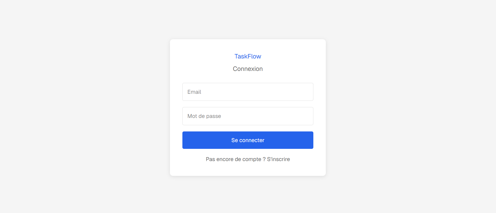
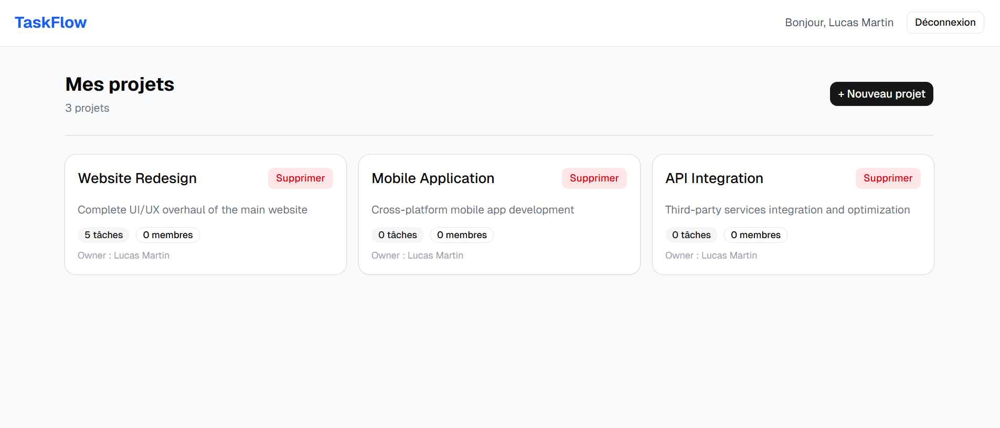
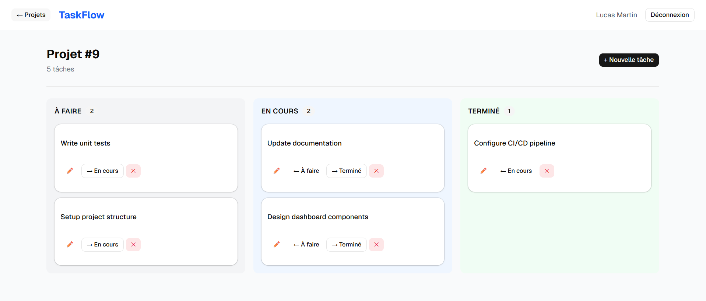

# TaskFlow 🚀

A full-stack task management application built with Spring Boot and React TypeScript.


## 🌐 Live Demo

**[https://taskflow.massinissaamir.dev](https://taskflow.massinissaamir.dev)**

## Screenshots

### Login


### Dashboard


### Kanban Board


## Features

- **JWT Authentication** — Secure register/login with BCrypt password hashing
- **Project Management** — Create, update, delete projects with member management
- **Kanban Board** — Move tasks between TODO / IN_PROGRESS / DONE columns
- **Role-based Access** — ADMIN and USER roles with protected endpoints
- **Pagination** — Paginated task listing with status filtering
- **Full Docker Support** — One command to run the entire stack
- **Unit Tests** — 12 tests with JUnit 5 and Mockito

## Tech Stack

### Backend
| Technology | Version | Purpose |
|---|---|---|
| Java | 17 | Language |
| Spring Boot | 3.5 | Framework |
| Spring Security | 6 | Authentication & Authorization |
| Spring Data JPA | 3.5 | ORM |
| PostgreSQL | 16 | Database |
| JWT (jjwt) | 0.12.3 | Token-based auth |
| Lombok | latest | Boilerplate reduction |
| JUnit 5 + Mockito | latest | Unit testing |

### Frontend
| Technology | Version | Purpose |
|---|---|---|
| React | 18 | UI Framework |
| TypeScript | 5 | Type safety |
| Vite | 6 | Build tool |
| Tailwind CSS | 4 | Styling |
| shadcn/ui | latest | UI Components |
| Axios | latest | HTTP client |
| React Router | 6 | Client-side routing |

### Infrastructure
| Technology | Purpose |
|---|---|
| Docker | Containerization |
| Docker Compose | Local orchestration |
| GitHub Actions | CI/CD pipeline |
| nginx | Frontend serving |

## Architecture

```text
taskflow/
├── backend/                          # Spring Boot REST API
│   └── src/main/java/com/taskflow/
│       ├── controller/               # REST controllers
│       ├── service/                  # Business logic
│       ├── repository/               # Spring Data JPA repositories
│       ├── model/                    # JPA entities
│       ├── dto/                      # Request / Response DTOs
│       ├── security/                 # JWT & Spring Security
│       ├── exception/                # Global exception handling
│       └── config/                   # Application configuration
│
├── frontend/                         # React + TypeScript application
│   └── src/
│       ├── features/
│       │   ├── auth/                 # Authentication pages
│       │   ├── dashboard/            # Dashboard & analytics
│       │   ├── projects/             # Project management
│       │   └── tasks/                # Kanban board & tasks
│       │
│       ├── shared/
│       │   ├── api/                  # Axios clients
│       │   ├── components/           # Reusable UI components
│       │   ├── context/              # React context
│       │   └── types/                # TypeScript types
│       │
│       └── pages/                    # Application pages
│
├── docker-compose.yml                # Local development environment
├── .env.example                      # Environment variables example
└── README.md
```

## Getting Started

### Prerequisites

- Docker Desktop
- Git

### Run with Docker Compose

Clone the repository

    git clone https://github.com/amirm-code/taskflow.git
    cd taskflow

Copy environment variables

    cp .env.example .env

Edit .env with your values, then start the entire stack

    docker compose up --build

The app will be available at:

- **Live** → https://taskflow.massinissaamir.dev
- **Frontend** → http://localhost:3000
- **Backend API** → http://localhost:8080
- **API Health** → http://localhost:8080/actuator/health

## API Endpoints

### Authentication

    POST /api/auth/register   → Create account
    POST /api/auth/login      → Get JWT token

### Projects

    GET    /api/projects                           → List my projects
    POST   /api/projects                           → Create project
    GET    /api/projects/{id}                      → Get project
    PUT    /api/projects/{id}                      → Update project
    DELETE /api/projects/{id}                      → Delete project
    POST   /api/projects/{id}/members/{userId}     → Add member

### Tasks

    GET    /api/projects/{id}/tasks                        → List tasks
    POST   /api/projects/{id}/tasks                        → Create task
    PUT    /api/projects/{id}/tasks/{taskId}               → Update task
    PATCH  /api/projects/{id}/tasks/{taskId}/status        → Update status
    DELETE /api/projects/{id}/tasks/{taskId}               → Delete task
    GET    /api/projects/{id}/tasks/paginated              → Paginated tasks

## Environment Variables

Copy `.env.example` and fill in your values:

    DB_NAME=taskflow
    DB_USER=your_db_user
    DB_PASSWORD=your_db_password
    JWT_SECRET=your_jwt_secret_base64

## Running Tests

    cd backend
    ./mvnw test

Result: Tests run: 12, Failures: 0, Errors: 0 — BUILD SUCCESS

## CI/CD

GitHub Actions pipeline runs on every push to main:

- ✅ Maven build and tests
- ✅ Docker image build
- ✅ Push to GitHub Container Registry (GHCR)

## License

MIT